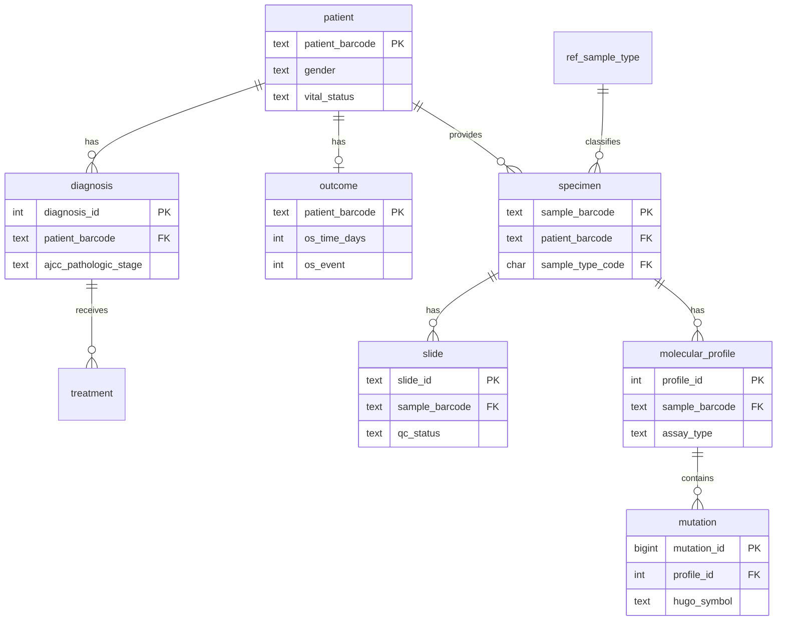

# Entity-Relationship Diagram

```mermaid
erDiagram
    patient ||--o{ diagnosis : has
    patient ||--o| outcome : has
    patient ||--o{ specimen : provides
    diagnosis ||--o{ treatment : receives
    specimen ||--o{ slide : has
    specimen ||--o{ molecular_profile : has
    molecular_profile ||--o{ mutation : contains
    ref_sample_type ||--o{ specimen : classifies

    patient {
        text patient_barcode PK
        text gender
        text vital_status
    }
    diagnosis {
        int diagnosis_id PK
        text patient_barcode FK
        text ajcc_pathologic_stage
    }
    outcome {
        text patient_barcode PK
        int os_time_days
        int os_event
    }
    specimen {
        text sample_barcode PK
        text patient_barcode FK
        char sample_type_code FK
    }
    slide {
        text slide_id PK
        text sample_barcode FK
        text qc_status
    }
    molecular_profile {
        int profile_id PK
        text sample_barcode FK
        text assay_type
    }
    mutation {
        bigint mutation_id PK
        int profile_id FK
        text hugo_symbol
    }
```
